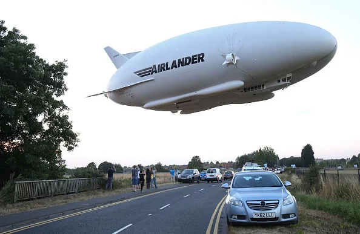
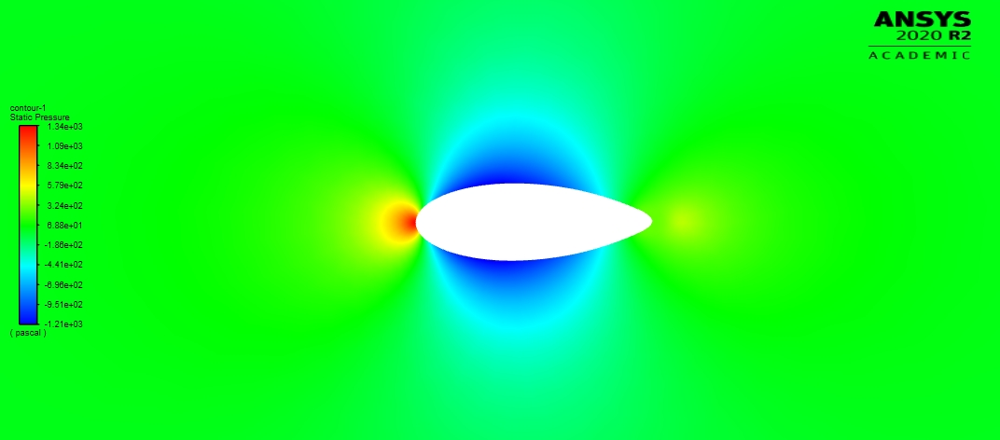
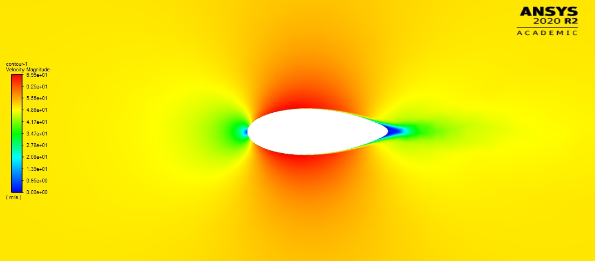
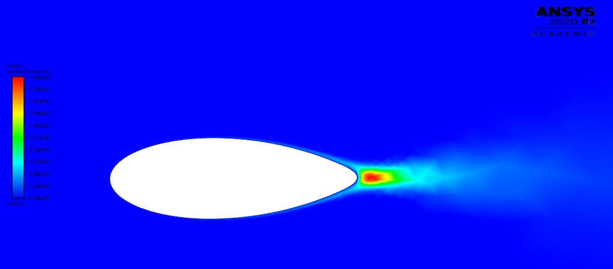
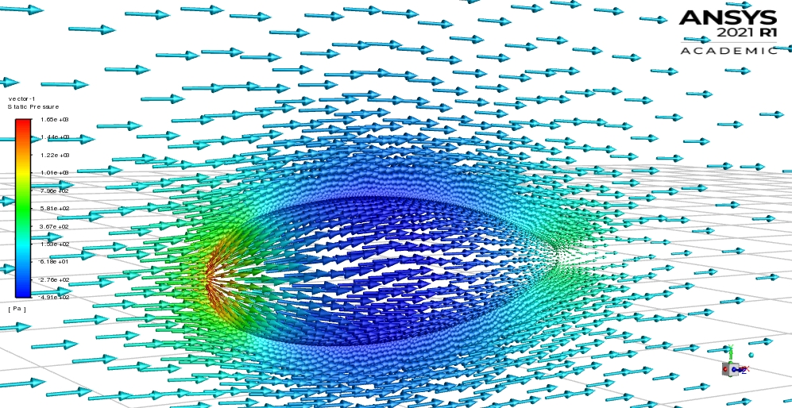
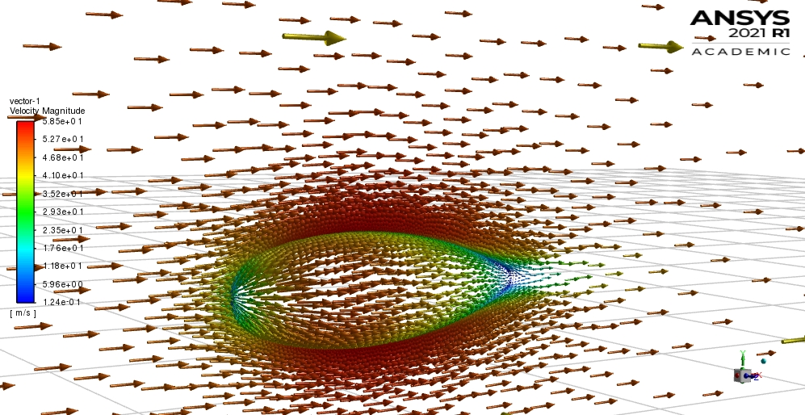
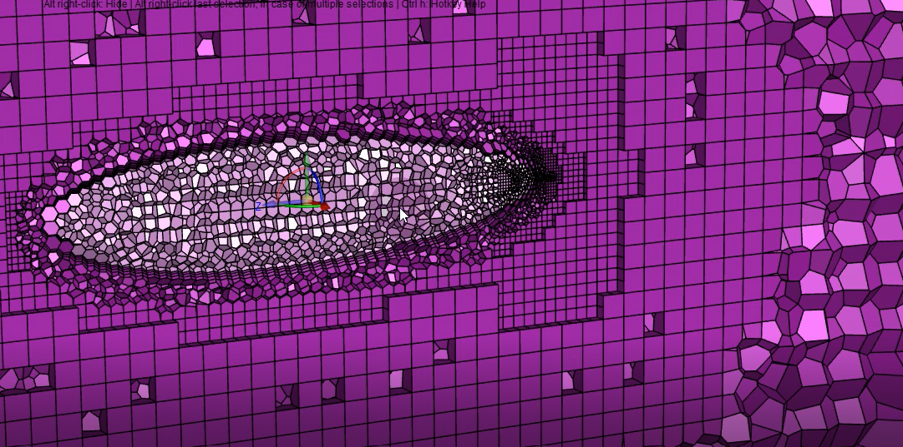

# CFD_Project
Here i have done CFD Simulation of Airfoil using Ansys ( commercial cfd software ) and OpenFoam (opensource software). 

# [AirShip_Shape_Optimization]() ⭐

&nbsp;
&nbsp;
&nbsp;
&nbsp; 
&nbsp;
&nbsp;
&nbsp;
&nbsp; 

## What is CFD ? 🤔

#### CDF - Computational fluid dynamics
#### Computational fluid dynamics (CFD) is a science that uses data structures to solve issues of fluid flow -- like velocity, density, and chemical compositions. This technology is used in areas like cavitation prevention, aerospace engineering, HVAC engineering, electronics manufacturing, and way more.

## Overview 👀

** Airship Pressure Contour

** Airship Velocity Contour

** Airship Turbulence Contour

##- Preprocessing - Simulation - Postprocessing 👨🏻‍💻 

## Here I have shown my project of CFD which i have done during B.Tech. . In These project i have used Ansys, OpenFoam, Fusion , Solidworks 🤔
- **Ansys - It's a very nice simulation software here we can perform all the steps starting from preprocessing to the end of postprocessing**
- **OpenFoam - It's a OpenSource CFD software where we can do simulation without any contraints.**
- **Fusion - It's a good CAD software where we can do stadanrd CAD modeling**

- ** https://grabcad.com/adarsh.shrivastava-4 **

## MACHINE LEARNING
** I have also used different machine learning tools to do the OPTIMIZATION of tools. 
** There are various porcess Automation technique By which I can reduce working time during performing the large number of 
** simulation🗃

- [PYTHON]([(https://www.python.org/)]) - **PYTHON IS A VERY EASY PROGRAMMING LANGUAGE **
- [NUMPY](https://numpy.org/) - **A Python library used for easy mathematical calculations**
- [PANDAS]((https://pandas.pydata.org/)) - **A Python library used for data cleaning**

